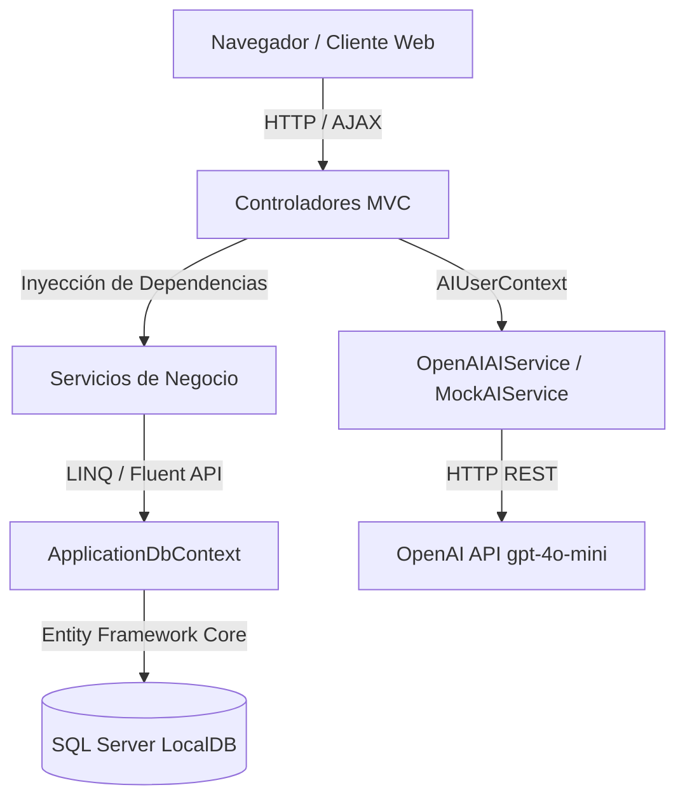
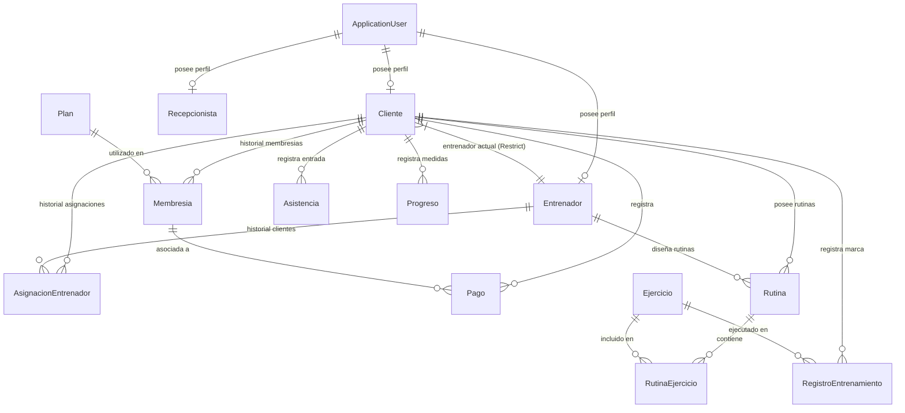
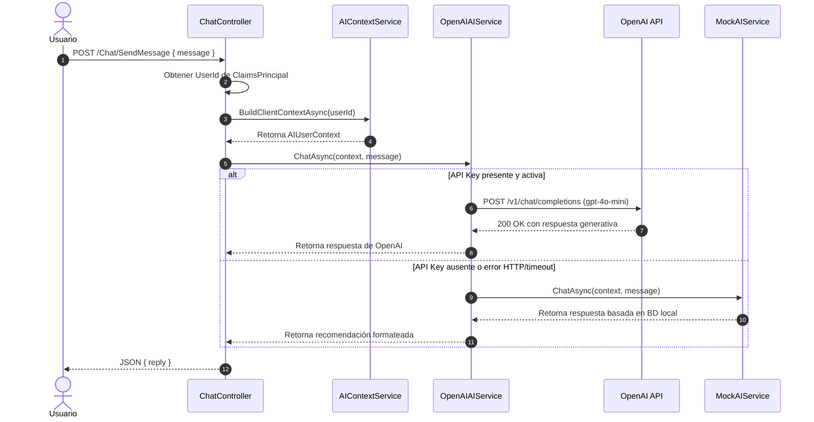

# MUSCLE HOUSE — Sistema Web Inteligente de Gestión de Gimnasio

¡Bienvenido a **MUSCLE HOUSE**! Un sistema web deportivo, premium y sumamente moderno diseñado para la administración integral de un gimnasio y el seguimiento interactivo del rendimiento de sus miembros utilizando Inteligencia Artificial.

Este proyecto ha sido desarrollado bajo una arquitectura limpia de Modelo-Vista-Controlador (MVC) en **.NET 10**, asegurando que todas las reglas de negocio, autorizaciones y control de seguridad horizontal y vertical se cumplan de forma robusta y profesional.

---

## 📋 Tabla de Contenidos
1. [Descripción General del Proyecto](#1-descripción-general-del-proyecto)
2. [Características Principales](#2-características-principales)
3. [Tecnologías Utilizadas](#3-tecnologías-utilizadas)
4. [Arquitectura del Sistema](#4-arquitectura-del-sistema)
5. [Estructura del Proyecto](#5-estructura-del-proyecto)
6. [Base de Datos y Modelado de Datos](#6-base-de-datos-y-modelado-de-datos)
7. [Diagrama de Entidad-Relación (ER)](#7-diagrama-de-entidad-relación-er)
8. [Sistema de Autenticación y Autorización](#8-sistema-de-autenticación-y-autorización)
9. [Módulos del Sistema](#9-módulos-del-sistema)
10. [Servicios de Negocio](#10-servicios-de-negocio)
11. [Asistente de IA (OpenAI & MockAIService)](#11-asistente-de-ia-openai--mockaiservice)
12. [Seguridad y Privacidad de la IA](#12-seguridad-y-privacidad-de-la-ia)
13. [Configuración Segura de OpenAI (User Secrets)](#13-configuración-segura-de-openai-user-secrets)
14. [Flujo de Funcionamiento de la IA](#14-flujo-de-funcionamiento-de-la-ia)
15. [Interfaz y Experiencia de Usuario (UI/UX)](#15-interfaz-y-experiencia-de-usuario-uiux)
16. [Cuentas y Credenciales de Prueba](#16-cuentas-y-credenciales-de-prueba)
17. [Paso a Paso para la Instalación y Ejecución](#17-paso-a-paso-para-la-instalación-y-ejecución)
18. [Configuración de Base de Datos y Migraciones](#18-configuración-de-base-de-datos-y-migraciones)
19. [Matriz de Roles y Permisos](#19-matriz-de-roles-y-permisos)
20. [Flujos Principales de Negocio](#20-flujos-principales-de-negocio)
21. [Ejecución de Pruebas Automatizadas](#21-ejecución-de-pruebas-automatizadas)
22. [Mantenimiento y Extensión del Sistema](#22-mantenimiento-y-extensión-del-sistema)
23. [Estado Actual y Verificación de Cumplimiento](#23-estado-actual-y-verificación-de-cumplimiento)

---

## 1. Descripción General del Proyecto

### ¿Qué es MUSCLE HOUSE?
**MUSCLE HOUSE** es una plataforma web inteligente de gestión integral de gimnasios. Combina la administración operativa diaria (clientes, membresías, cobros, asistencias, entrenadores) con herramientas avanzadas de entrenamiento deportivo (diseño de rutinas, registro de marcas/RPE, evolución física corporal) y un **Asistente de IA interactivo** capacitado para dar recomendaciones nutricionales y de sobrecarga progresiva.

### Problema que Resuelve
La gestión tradicional de gimnasios mediante hojas de cálculo o software obsoleto genera descontrol en vencimientos de membresías, falta de visibilidad en ingresos, abandono del progreso físico de los clientes y comunicación fragmentada entre entrenadores y alumnos. MUSCLE HOUSE centraliza la operación en tiempo real, automatiza los flujos de cobro y check-in, y motiva al atleta con gráficos de rendimiento y soporte inteligente 24/7.

---

## 2. Características Principales

- **Registro Público de Usuarios (`/Account/Register`)**: Permite a nuevos atletas crear su cuenta de forma autónoma asignándoles estrictamente el rol `Usuario` (Cliente).
- **Gestión de Personal con Fotografía**: Administración de perfil, especialidad y horario de atención para Entrenadores y Recepcionistas con subida de imágenes a `wwwroot/uploads/`.
- **Catálogo Oficial de Planes de MUSCLE HOUSE**:
  - Diario (1 día — $5.00)
  - Mensual (30 días — $45.00)
  - Trimestral (90 días — $99.00)
  - Semestral (180 días — $160.00)
  - Anual (365 días — $260.00)
- **Historial de Asignación de Entrenadores (`AsignacionEntrenador`)**: Conserva el registro histórico de reasignaciones sin eliminar asignaciones pasadas.
- **Membresías y Pagos Históricos**: Soporta renovación acumulativa de fechas de vencimiento y registro de pagos por Efectivo, Tarjeta y Transferencia.
- **Búsqueda y Paginación en Servidor**: Búsqueda por texto libre, filtros de estado y paginación en servidor (10 ítems/página) evaluados sobre `IQueryable` mediante LINQ en Entity Framework Core.
- **Asistente de IA Personalizado (`gpt-4o-mini` & `MockAIService`)**: Extrae el contexto físico real del cliente (peso, medidas, rutina, cargas recientes) para responder consultas en español sin invadir datos de otros atletas.
- **Dashboards Interactivos por Rol con Chart.js**: Gráficos de distribución de ingresos, tipos de membresías y gráficos lineales de doble eje para evolución de peso y medidas corporales.

---

## 3. Tecnologías Utilizadas

| Tecnología | Dónde se utiliza | Propósito en MUSCLE HOUSE |
| :--- | :--- | :--- |
| **.NET 10 / C# 13** | Solución principal | Framework de desarrollo web y lenguaje de programación de alto rendimiento. |
| **ASP.NET Core MVC** | Controladores y Vistas | Patrón de arquitectura para separar la lógica de presentación de los servicios de negocio. |
| **Entity Framework Core 10** | Capa de datos / Data | ORM oficial para consultas LINQ, mapeo Fluent API e interacción con la base de datos. |
| **SQL Server / LocalDB** | Base de Datos (`GymManagementDB`) | Motor de base de datos relacional (con soporte In-Memory transparente para entornos Linux/CI). |
| **ASP.NET Core Identity** | Autenticación y Autorización | Módulo de seguridad para gestión de usuarios, passwords con hash, cookies y roles. |
| **Bootstrap 5** | Maquetación UI (`theme.css`) | Sistema de diseño responsive con tema oscuro deportivo premium (`#090909`, `#17191B`, `#E31C25`). |
| **Chart.js 4** | Dashboards | Gráficos tipo Doughnut, Pie y Line interactivos para analítica de ventas y progreso físico. |
| **OpenAI Chat API** | Servicio de IA (`OpenAIAIService`) | Modelo `gpt-4o-mini` para generación de soporte deportivo inteligente. |
| **xUnit & Moq** | Proyecto `MuscleHouse.Tests` | Framework de pruebas unitarias e integración con mocks de servicios y DbContext en memoria. |

---

## 4. Arquitectura del Sistema

El sistema implementa una arquitectura por capas desacopladas dentro del patrón ASP.NET Core MVC:



---

## 5. Estructura del Proyecto

```text
MuscleHouse/                         <- Proyecto ASP.NET Core MVC Principal
├── Controllers/                     <- Controladores HTTP (Account, Admin, Recepcionista, Entrenador, Cliente, Chat)
├── Data/                            <- ApplicationDbContext, DbInitializer (Seed idempotente)
├── Migrations/                      <- Migraciones de Entity Framework Core para SQL Server
├── Models/                          <- Entidades del modelo de dominio (14 modelos) y ApplicationUser
├── Services/                        <- Interfaces e Implementaciones de servicios de negocio e IA
├── ViewModels/                      <- Modelos de vista para binding de formularios y dashboards
├── Views/                           <- Plantillas de vista Razor estructuradas por rol y layout
│   ├── Account/                     <- Vistas de Login y Register
│   ├── Admin/                       <- Vistas administrativas (Clientes, Entrenadores, Recepcionistas, Planes, etc.)
│   ├── Recepcionista/               <- Vistas operativas de recepción (Check-in, Membresías, Pagos)
│   ├── Entrenador/                  <- Vistas de coach (Mis clientes, Diseñador de rutinas, Progresos)
│   ├── Cliente/                     <- Perfil de cliente (Dashboard, Membresía, Rutina, Gráficos de evolución)
│   ├── Chat/                        <- Interfaz del Asistente IA
│   ├── Home/                        <- Página principal pública y catálogo de personal público
│   └── Shared/                      <- _Layout.cshtml, _ValidationScriptsPartial.cshtml
├── wwwroot/                         <- Archivos estáticos
│   ├── css/                         <- theme.css, layout.css, components.css (Variables CSS globales)
│   └── uploads/                     <- Fotografías de entrenadores y recepcionistas
├── appsettings.json                 <- Configuración de cadenas de conexión y logging
└── Program.cs                       <- Pipeline HTTP, inyección de dependencias y Seeding de BD

MuscleHouse.Tests/                   <- Proyecto de Pruebas Automatizadas (xUnit)
└── ControllersTests.cs              <- Pruebas unitarias de controladores, seguridad e IA (25 test cases)
```

---

## 6. Base de Datos y Modelado de Datos

Base de datos oficial: `GymManagementDB` en servidor `(localdb)\MSSQLLocalDB`.

### Entidades Principales:
1. **ApplicationUser** (`AspNetUsers`): Hereda de `IdentityUser`. Almacena credenciales y correo.
2. **Cliente**: Perfil del atleta (`Nombre`, `Apellido`, `Telefono`, `FechaNacimiento`, `Objetivo`, `EntrenadorId`, `Activo`).
3. **Entrenador**: Perfil del coach (`Nombre`, `Apellido`, `Especialidad`, `Experiencia`, `Descripcion`, `Fotografia`, `Activo`).
4. **Recepcionista**: Perfil del recepcionista (`Nombre`, `Apellido`, `HorarioAtencion`, `Descripcion`, `Fotografia`, `Activo`).
5. **AsignacionEntrenador**: Historial de reasignaciones (`ClienteId`, `EntrenadorId`, `FechaInicio`, `FechaFin`).
6. **Plan**: Catálogo de suscripciones (`Nombre`, `DuracionDias`, `Precio`, `Descripcion`, `Activo`).
7. **Membresia**: Historial de suscripciones compradas (`ClienteId`, `PlanId`, `FechaInicio`, `FechaVencimiento`, `PrecioPagado`, `Estado`).
8. **Pago**: Transacciones (`ClienteId`, `MembresiaId`, `Monto`, `Fecha`, `MetodoPago`, `Estado`).
9. **Asistencia**: Control de acceso (`ClienteId`, `FechaHora`).
10. **Ejercicio**: Catálogo de ejercicios (`Nombre`, `GrupoMuscular`, `Descripcion`, `Instrucciones`, `Activo`).
11. **Rutina**: Plan de entrenamiento asignado (`ClienteId`, `EntrenadorId`, `Nombre`, `FechaCreacion`, `Activa`).
12. **RutinaEjercicio**: Tabla intermedia (`RutinaId`, `EjercicioId`, `Series`, `Repeticiones`, `PesoRecomendado`, `DescansoSegundos`, `Orden`, `Observaciones`).
13. **Progreso**: Evolución física corporal (`ClienteId`, `Fecha`, `Peso`, `Pecho`, `Cintura`, `Brazo`, `Pierna`, `Cadera`, `Observaciones`).
14. **RegistroEntrenamiento**: Marcas de fuerza (`ClienteId`, `EjercicioId`, `Series`, `Repeticiones`, `Peso`, `RPE`, `Fecha`, `Observaciones`).
15. **Notificacion**: Avisos del sistema (`UserId`, `Titulo`, `Mensaje`, `Fecha`, `Leida`).

---

## 7. Diagrama de Entidad-Relación (ER)



---

## 8. Sistema de Autenticación y Autorización

Implementado con **ASP.NET Core Identity** sobre la clase `ApplicationUser`.
- **Cookies de Sesión**: Redirección automática tras login según el rol del usuario:
  - `Administrador` ➔ `/Admin/Dashboard`
  - `Recepcionista` ➔ `/Recepcionista/Dashboard`
  - `Entrenador` ➔ `/Entrenador/Dashboard`
  - `Usuario` ➔ `/Cliente/Dashboard`
- **Autorización por Atributos**:
  - `[Authorize(Roles = "Administrador")]`
  - `[Authorize(Roles = "Recepcionista")]`
  - `[Authorize(Roles = "Entrenador")]`
  - `[Authorize(Roles = "Usuario")]`

---

## 9. Módulos del Sistema

### Módulo de Administración (Admin)
- **Gestión de Personal**: Crear/editar entrenadores y recepcionistas con validación de imágenes JPG/PNG/WebP hasta 2 MB.
- **Catálogo de Planes y Ejercicios**: Activación/inactivación lógica de planes y ejercicios.
- **Reportes Financieros**: Análisis de ingresos totales, ventas por plan y método de pago con Chart.js.

### Módulo de Recepción
- **Registro de Clientes y Check-in**: Registro rápido de clientes y marcado de asistencias.
- **Cobro y Renovación de Membresías**: Cálculo automático acumulativo de fecha de vencimiento.

### Módulo de Entrenador (Coach)
- **Aislamiento de Clientes**: Búsqueda y gestión limitada estrictamente a los alumnos asignados.
- **Diseñador de Rutinas Dinámicas**: Asignación de series, repeticiones, peso sugerido y descansos.
- **Control de Progreso Corporal**: Registro de peso y medidas de los alumnos.

### Módulo de Cliente / Atleta
- **Mi Dashboard & Rutina**: Visualización de días restantes de membresía y rutina activa.
- **Mi Progreso Físico**: Gráfico dinámico de evolución de peso y medidas corporales.
- **Asistente IA**: Chat interactivo para dudas nutricionales y de sobrecarga progresiva.

---

## 10. Servicios de Negocio

- `IMembershipService` / `MembershipService`: Lógica acumulativa de renovación de membresías y vencimientos.
- `IPaymentService` / `PaymentService`: Registro de pagos asociados a membresías.
- `IAttendanceService` / `AttendanceService`: Registro de marcas de entrada de clientes.
- `IWorkoutService` / `WorkoutService`: Creación y consulta de rutinas y marcas de fuerza.
- `IProgressService` / `ProgressService`: Registro e historial de progreso corporal.
- `IStaffService` / `StaffService`: Gestión de perfiles de personal y asignación histórica de entrenadores.
- `ISecurityService` / `SecurityService`: Verificación de aislamiento horizontal de clientes y entrenadores.
- `IAIContextService` / `AIContextService`: Extracción del DTO `AIUserContext` para el Asistente IA.
- `IAIService` / `OpenAIAIService` / `MockAIService`: Motor de IA generativa con fallback automático.

---

## 11. Asistente de IA (OpenAI & MockAIService)

El módulo de IA utiliza un patrón de estrategia con fallback transparente:
1. `AIContextService` construye un DTO `AIUserContext` que extrae el objetivo del cliente, su peso actual, medidas corporales, rutina activa y sus últimos registros de sobrecarga progresiva.
2. `OpenAIAIService` inyecta este contexto en una llamada HTTP REST a OpenAI usando el modelo `gpt-4o-mini`.
3. Si la clave de API está ausente o la llamada falla (error 401, 429, timeout, error de red), la aplicación invoca automáticamente a `MockAIService`, el cual genera recomendaciones formateadas en Markdown basadas en los datos reales del cliente en la BD.

---

## 12. Seguridad y Privacidad de la IA

- **Aislamiento Multi-Inquilino**: El identificador del cliente se obtiene directamente del `ClaimsPrincipal` mediante `UserManager.GetUserId(User)`. Ningún `userId` o `clienteId` es aceptado desde el cliente en el JSON de la solicitud AJAX.
- **Protección de Credenciales**: Las claves de API nunca se renderizan en el HTML, JavaScript o respuestas AJAX. Los mensajes de error son sanitizados para ocultar patrones `sk-*` o encabezados Bearer.
- **Solo Lectura**: El Asistente IA no posee endpoints de mutación en la base de datos; únicamente genera recomendaciones explicativas.

---

## 13. Configuración Segura de OpenAI (User Secrets)

Para desarrollo local, la clave de API debe almacenarse en **ASP.NET Core Secret Manager**:

```bash
dotnet user-secrets set "OpenAI:ApiKey" "TU_OPENAI_API_KEY_AQUI" --project MuscleHouse/MuscleHouse.csproj
```

Alternativamente, el sistema detecta la variable de entorno del sistema `OPENAI_API_KEY`.

---

## 14. Flujo de Funcionamiento de la IA



---

## 15. Interfaz y Experiencia de Usuario (UI/UX)

- **Paleta Oficial MUSCLE HOUSE**:
  - Fondo general: `#090909`
  - Superficie / Cards: `#17191B`
  - Superficie elevada: `#1D2023`
  - Bordes: `#2A2D30`
  - Rojo de marca oficial: `#E31C25` (Hover: `#FF3038`)
  - Texto principal: `#F5F5F5` (Gris secundario: `#D0D3D6`)
- **Controles Personalizados**: Checkboxes oscuros alineados de `16px x 16px` con tildes `#E31C25` y etiquetas 100% clickeables.
- **Gráficos Chart.js**: Paleta cromática coordinada para diferenciar cada plan de entrenamiento y método de pago con leyendas de alto contraste.

---

## 16. Cuentas y Credenciales de Prueba

Al iniciar la aplicación, `DbInitializer.SeedAsync` poblará automáticamente los roles e insertará las siguientes cuentas de prueba:

| Rol | Correo Electrónico | Contraseña |
| :--- | :--- | :--- |
| **Administrador** | `admin@musclehouse.com` | `MuscleHouse123!` |
| **Recepcionista** | `recepcionista@musclehouse.com` | `MuscleHouse123!` |
| **Entrenador** | `entrenador@musclehouse.com` | `MuscleHouse123!` |
| **Usuario (Cliente)** | `cliente@musclehouse.com` | `MuscleHouse123!` |

---

## 17. Paso a Paso para la Instalación y Ejecución

### 1. Requisitos Previos
- **.NET SDK 10** instalado en la máquina.
- **SQL Server LocalDB** (en Windows) o instancia de SQL Server relacional.

### 2. Clonar / Abrir el Proyecto
```bash
git clone <URL_DEL_REPOSITORIO>
cd AgenciaPublicidad
```

### 3. Restaurar Paquetes y Compilar
```bash
dotnet restore
dotnet build MuscleHouse.sln
```

### 4. Configurar User Secrets (Opcional para OpenAI)
```bash
dotnet user-secrets set "OpenAI:ApiKey" "sk-tu-clave-aqui" --project MuscleHouse/MuscleHouse.csproj
```

### 5. Iniciar la Aplicación
```bash
dotnet run --project MuscleHouse/MuscleHouse.csproj
```
Abre tu navegador en `http://localhost:5000` o `https://localhost:5001`.

---

## 18. Configuración de Base de Datos y Migraciones

La cadena de conexión por defecto se encuentra configurada en `MuscleHouse/appsettings.json`:
```json
"ConnectionStrings": {
  "DefaultConnection": "Server=(localdb)\\MSSQLLocalDB;Database=GymManagementDB;Trusted_Connection=True;MultipleActiveResultSets=true;TrustServerCertificate=True"
}
```

Para aplicar manualmente las migraciones de Entity Framework Core sobre SQL Server:
```bash
dotnet ef database update --project MuscleHouse/MuscleHouse.csproj
```

---

## 19. Matriz de Roles y Permisos

| Módulo / Función | Administrador | Recepcionista | Entrenador | Usuario (Cliente) |
| :--- | :---: | :---: | :---: | :---: |
| **Dashboard Global & Métricas** | ✅ | ✅ | ✅ (Sólo suyos) | ✅ (Sólo suyos) |
| **Registro Público de Usuarios** | ✅ | ✅ | ❌ | ✅ |
| **Gestión de Clientes (Editar/Inactivar)** | ✅ | ✅ | ❌ | ❌ |
| **Gestión de Personal (Fotos/Horarios)** | ✅ | ❌ | ❌ | ❌ |
| **Gestión de Planes y Ejercicios** | ✅ | ❌ | ❌ | ❌ |
| **Renovación de Membresías y Cobros** | ✅ | ✅ | ❌ | ❌ |
| **Control de Asistencias (Check-in)** | ✅ | ✅ | ❌ | ❌ |
| **Diseño de Rutinas** | ❌ | ❌ | ✅ (Asignados) | ❌ |
| **Registro de Progreso Físico** | ✅ | ❌ | ✅ (Asignados) | ✅ (Propio) |
| **Consulta del Asistente IA** | ❌ | ❌ | ❌ | ✅ |

---

## 20. Flujos Principales de Negocio

1. **Registro e Ingreso de Atleta**: Un nuevo usuario se registra en `/Account/Register`, se le asigna el rol `Usuario` y se genera su registro en `Cliente`.
2. **Venta / Renovación de Membresía**: En Recepción (`/Recepcionista/Membresias`), se selecciona el cliente y un plan activo (Diario, Mensual, Trimestral, Semestral, Anual). Se crea un registro en `Membresia` y la transacción en `Pago`.
3. **Asignación de Coach**: El Administrador o Recepcionista asigna un entrenador al cliente, registrando el cambio en `AsignacionEntrenador`.
4. **Diseño de Rutina y Cargas**: El Entrenador asignado crea la rutina activa en `/Entrenador/CrearRutina` especificando series, reps y peso sugerido.
5. **Consulta Inteligente**: El Cliente abre `/Chat/Index` y consulta al Asistente IA, el cual utiliza sus medidas y marcas recientes para guiar su nutrición y sobrecarga progresiva.

---

## 21. Ejecución de Pruebas Automatizadas

El proyecto de pruebas de xUnit (`MuscleHouse.Tests`) cuenta con **25 pruebas unitarias e integrales** que validan la seguridad, autenticación, aislamiento por roles y la IA.

Para ejecutar todas las pruebas:
```bash
dotnet test --logger "console;verbosity=normal"
```

---

## 22. Mantenimiento y Extensión del Sistema

- **Agregar una nueva Entidad**: Crear el modelo en `MuscleHouse/Models/`, agregarlo a `ApplicationDbContext.cs`, configurar relaciones en `OnModelCreating` y generar la migración con `dotnet ef migrations add <Nombre> --project MuscleHouse/MuscleHouse.csproj`.
- **Agregar un nuevo Servicio**: Crear la interfaz en `MuscleHouse/Services/IService.cs`, su implementación en `MuscleHouse/Services/Service.cs` y registrarla en `Program.cs` usando `builder.Services.AddScoped<IService, Service>();`.
- **Modificar la Paleta de Colores**: Ajustar las variables CSS en `MuscleHouse/wwwroot/css/theme.css` (`:root`).

---

## 23. Estado Actual y Verificación de Cumplimiento

- **Compilación**: ✅ 0 errores, 0 advertencias (`dotnet build MuscleHouse.sln`).
- **Pruebas Automatizadas**: ✅ 25/25 test cases aprobados (`dotnet test`).
- **Base de Datos**: ✅ Proveedor SQL Server / LocalDB exclusivo (`GymManagementDB`).
- **Seguridad**: ✅ Control de acceso por roles e inhibición de vulnerabilidades IDOR.
- **Asistente IA**: ✅ Modelo `gpt-4o-mini` integrado con fallback transparente a `MockAIService`.
